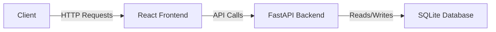
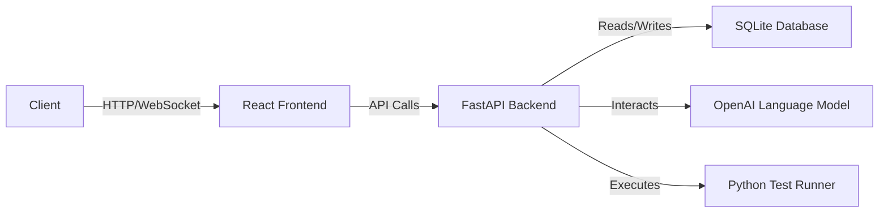
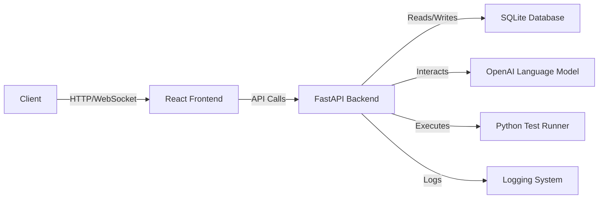

# Code Snippet Generation System

## Milestone 1: Setup & Configuration
- **Feature**: Project Setup
  - **Actions**:
    1. Set up FastAPI backend
    1. Configure SQLite database
    1. Set up frontend UI using React the provided `design.html` as a template
    1. Configure CI/CD pipeline with GitHub Actions

**System Architecture**

## Milestone 2: Minimum Viable Product (MVP)
- **Feature**: Code Snippet Generation
  - **Actions**:
    1. Implement API endpoints for generating code snippets in Python, JavaScript, and Ruby
    1. Integrate with OpenAI language model for code generation
    1. Handle user input for code description and language selection
    1. Display generated code snippets in the UI
- **Feature**: Feedback Processing
  - **Actions**:
    1. Implement API endpoints for processing feedback in English and Japanese
    1. Integrate with OpenAI language model for feedback understanding and code improvement
    1. Update generated code snippets based on user feedback
- **Feature**: Test Case Generation & Improvement
  - **Actions**:
    1. Implement API endpoints for generating test cases based on code snippets
    1. Integrate with OpenAI language model for test case generation
    1. Process user feedback to improve generated test cases
- **Feature**: Test Execution & Code Improvement
  - **Actions**:
    1. Implement API endpoints for executing tests on Python code snippets
    1. Display test results in the UI
    1. Analyze test results and user feedback to improve code snippets
- **Feature**: UI Development
  - **Actions**:
    1. Develop React components as per the design template
    1. Implement functionality to load, delete, and create new code snippets
    1. Automatically save new code snippets on "Generate" button click
    1. Automatically generate title and language for code snippets
    1. Implement syntax highlighting for supported languages using a React syntax highlighting library
    1. Hide delete button when a code snippet is selected
    1. Display user-friendly error messages and feedback using React components

**System Architecture**

## Milestone 3: Enhancements & Optimizations
- **Feature**: Enhanced Code Quality
  - **Actions**:
    1. Integrate advanced techniques like Chain-of-thought for generating higher quality code
- **Feature**: Security & Logging
  - **Actions**:
    1. Implement proper handling of prompt injection to enhance LLM security
    1. Implement logging functionality to monitor and debug the system

**System Architecture**

## Milestone 4: Final Touches & Deployment
- **Feature**: Final Testing & Deployment
  - **Actions**:
    1. Conduct thorough testing of all implemented features
    1. Ensure the project meets all requirements and quality standards
    1. Prepare the project for final deployment and submission

**System Architecture**

